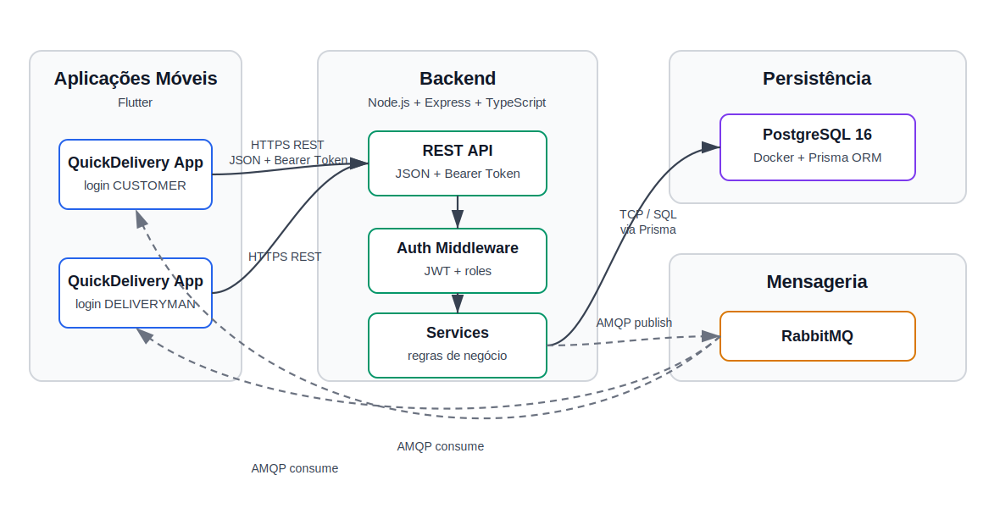

# QuickDelivery - Arquitetura

  

Diagrama de arquitetura do QuickDelivery

Os clientes da API consomem endpoints REST em Node.js, Express e TypeScript com payloads JSON e autenticação por Bearer Token. O middleware de autenticação valida o token JWT e disponibiliza `userId` e `role` para as regras de negócio, permitindo separar permissões de `CUSTOMER` e `DELIVERYMAN`.

A API persiste dados no PostgreSQL por meio do Prisma ORM. O modelo atual usa `users` e `deliveries`: clientes criam entregas próprias, entregadores visualizam entregas pendentes ou atribuídas a eles, e as transições de status são validadas nos services.

O RabbitMQ é usado para a comunicação assíncrona. Eventos como `delivery.created`, `delivery.accepted` e `delivery.status_changed` são publicados via AMQP e consumidos pela fila `quickdelivery.delivery-events`, demonstrando o desacoplamento entre produtor e consumidor.
