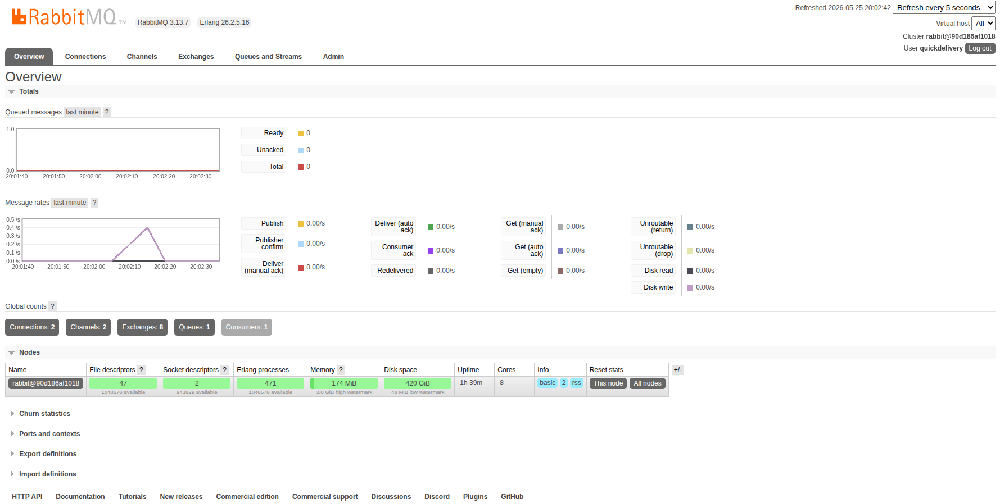
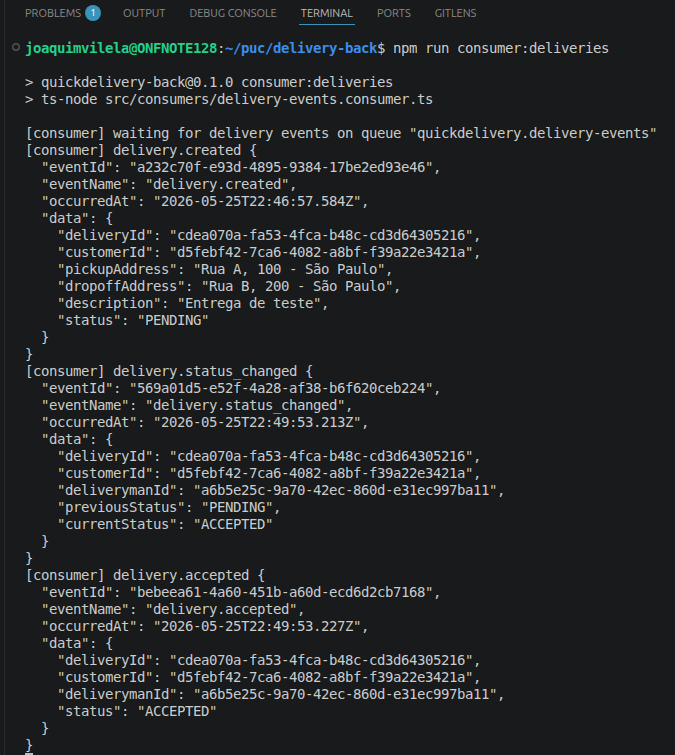

# QuickDelivery - RabbitMQ

## 1. Objetivo

O RabbitMQ foi integrado ao QuickDelivery para demonstrar comunicação assíncrona entre o backend e um consumidor de eventos. O backend continua recebendo requisições REST, mas agora publica mensagens sempre que uma entrega é criada ou tem seu status alterado.

## 2. Por que RabbitMQ

O RabbitMQ foi escolhido porque é uma opção de MOM prevista no enunciado do projeto e possui suporte direto ao padrão de filas e exchanges. Ele também oferece painel web para visualização das filas, mensagens e consumidores, facilitando a demonstração da Sprint 2.

## 3. Estrutura Implementada

A integração usa uma exchange do tipo `topic`:

```text
quickdelivery.events
```

A fila principal de eventos de entrega é:

```text
quickdelivery.delivery-events
```

Eventos publicados:

- `delivery.created`: publicado após a criação de uma entrega.
- `delivery.accepted`: publicado após o aceite por um entregador.
- `delivery.status_changed`: publicado após qualquer mudança de status.

Fluxo da mensagem:

```text
Backend REST -> Exchange quickdelivery.events -> Fila quickdelivery.delivery-events -> Consumer
```

## 4. Como a Integração Foi Feita

O RabbitMQ roda via Docker Compose junto com o PostgreSQL. O backend usa a biblioteca `amqplib` para abrir conexão AMQP, declarar a exchange `quickdelivery.events` e publicar mensagens com routing keys específicas.

<div style="page-break-after: always;"></div>

O arquivo `src/infrastructure/rabbitmq.ts` concentra a conexão com o RabbitMQ. O arquivo `src/events/delivery-events.publisher.ts` monta e publica os eventos de entrega. O arquivo `src/consumers/delivery-events.consumer.ts` executa um consumidor que escuta a fila `quickdelivery.delivery-events`.

O service de entregas publica eventos depois que a operação no banco é concluída com sucesso. Assim, o PostgreSQL continua sendo a fonte da verdade e o RabbitMQ fica responsável pela comunicação assíncrona.

## 5. Comprovantes

### 5.1 Consumer no RabbitMQ

O painel do RabbitMQ mostra a fila `quickdelivery.delivery-events` com um consumidor conectado.

<p align="center">
  
</p>

<p align="center">Fila do RabbitMQ com consumer conectado</p>

### 5.2 Logs do Consumer

O terminal do consumidor mostra os eventos recebidos após as ações executadas pelo Postman.

<div style="page-break-after: always;"></div>

<p align="center">
  
</p>

<p align="center">Logs do consumer recebendo eventos</p>

Os logs comprovam que o backend publicou eventos no RabbitMQ e que outro processo consumiu essas mensagens pela fila, sem chamada REST direta entre eles.

Na Sprint 3, o aplicativo Flutter do cliente não consome diretamente o RabbitMQ. Ele reflete as mudanças de estado por polling periódico na API REST, para atualização assíncrona do app cliente. O RabbitMQ continua responsável pela publicação e consumo de eventos no backend.
